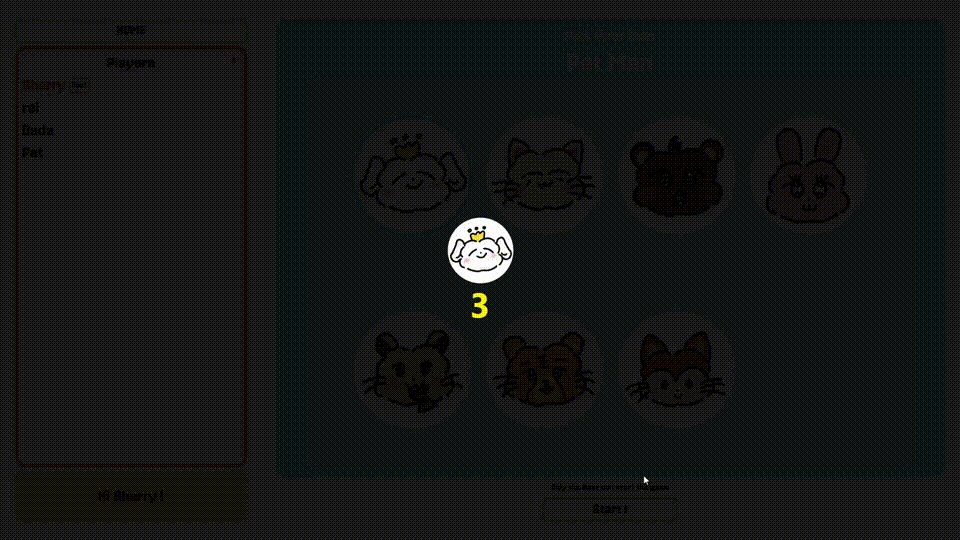

# PET-Man.io



## Implementation

* WebSocket

## Requirements

* Node.js
* Yarn
* Nginx
* SSL credentials (Nice to have, otherwise you need to use unsecured HTTP and WebSocket)
* A domain name (Nice to have)

## How to Run?

### Frontend (`rootdir/`)

Modify URI to the WebSocket server

```typescript
const socket = io('wss://<YOUR DOMAIN NAME>');      // src/pages/RoomPage/Room.tsx, L95
```

Compile TypeScript to JavaScript

```bash
yarn                                                # Install dependencies
yarn build
```
### Backend (`rootdir/server`)

```bash
cd server/
npm install                                         # Install dependencies
node index.js &                                     # Run WebSocket server in localhost:3001 by default
```

### Deployment

Use Nginx as example.

```bash
cp -r public/* /var/www/html                        # Let Nginx can load the files
sudo vim /etc/nginx/sites-available/pet-man         # See below for reference proxy configuration
sudo ln -s /etc/nginx/sites-available/pet-man \     # Link to enable PET-Man.io
    /etc/nginx/sites-enabled/pet-man
```

Reverse proxy configuration

```
location / {
    try_files $uri /$uri /index.html;
}

location /socket {
    proxy_pass http://localhost:3001;
    proxy_http_version 1.1;
    proxy_set_header Upgrade $http_upgrade;
    proxy_set_header Connection 'upgrade';
    proxy_set_header Host $host;
    proxy_cache_bypass $http_upgrade;
}
```

### Create SSL Credentials

```bash
sudo certbot --nginx -d <YOUR DOMAIN NAME>
```
